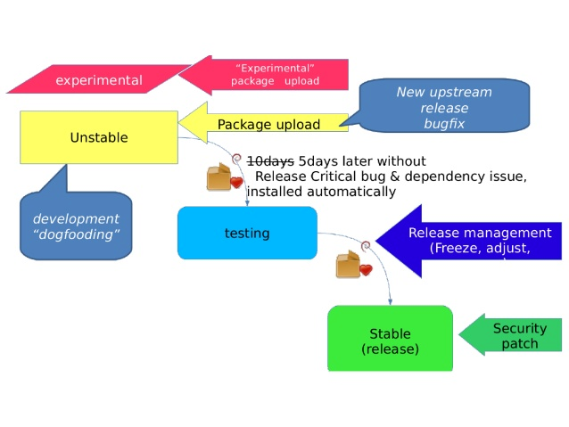
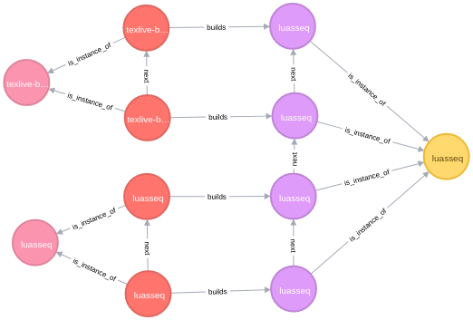
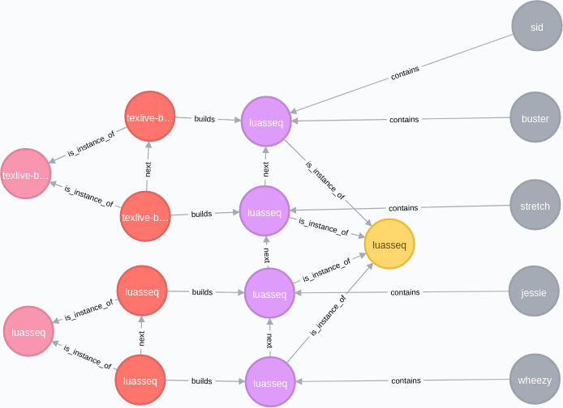
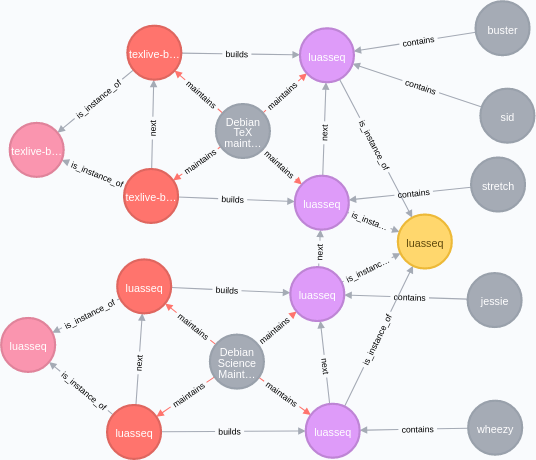
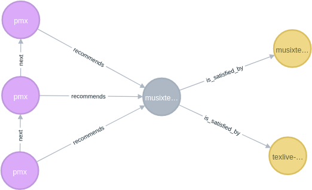
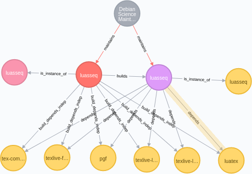
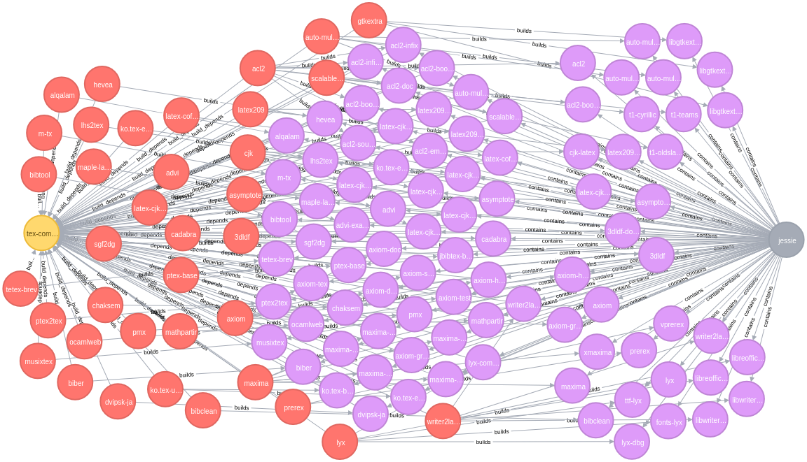

Analysing Debian Package with Neo4j
===================================


Overview
--------

The [Ultimate Debian Database
UDD](https://wiki.debian.org/UltimateDebianDatabase/) collects a variety
of data around Debian and Ubuntu: Packages and sources, bugs, history of
uploads, just to name a few. The database scheme reveals a [highly
de-normalized RDB](https://udd.debian.org/schema/). In this on-going
work we extract (some) data from UDD and represent it as a graph
database. Part 1 will give a short introduction to Debian and the
life time and structure of Debian packages. Part 2 develops the
graph database scheme (nodes and relations) from the inherent properties
of Debian packages. Part 3 describes how to get the data
from the UDD into Neo4j, give some sample queries, and discuss further
work. This work has been presented at the [Neo4j Online
Meetup](https://www.meetup.com/Neo4j-Online-Meetup/events/243206424/)
and a video recording of the presentation is available on
[YouTube](https://www.youtube.com/watch?v=lpqvv36SBQw).

Debian
------

[Debian](https://www.debian.org/) is an open source Linux distribution,
developed mostly by volunteers. With a history of already more than 20
years, Debian is one of the oldest Linux distributions. It sets itself
apart from many other Linux distributions by a strict set of license
rules that guarantees that everything within Debian is free according to
the [Debian Free Software
Guidelines](https://www.debian.org/social_contract#guidelines). Debian
also gave rise to a large set of offsprings, most widely known one is
[Ubuntu](https://www.ubuntu.com/). Debian contains not only the
underlying operating system (Linux) and the necessary tools, but also a
huge set of programs and applications, currently about 50000 software
packages. All of these packages come with full source code but are
already pre-compiled for easy consumption. To understand what
information we have transfered into Neo4j we need to take a look at how
Debian is structured, and how a packages lives within this environment.

### Debian releases

Debian employs release based software management, that is, a new Debian
version is released in more or less regular intervals. The current
stable release is [Debian
stretch](https://www.debian.org/releases/stable/) (Debian 9.2) and was
released first in June 2017, with the latest point release on October
7th, 2017. To prepare packages for the next stable release, they have to
go through a set of suites to make sure they conform to quality
assurance criteria. These suites are:

-   Development (sid): the entrance point for all packages, where the
    main development takes place;
-   Testing: packages that are ready to be released as the next stable
    release;
-   Stable: the status of the current stable release.

There are a few other suites like experimental or targeting security
updates, but we leave their discussion out here.

### Package and suite transitions

Packages have a certain life cycle within Debian. Consider the following
image (by Youheu Sasaki, CC-NC-SA):



Packages normally are uploaded into the unstable
suite and remain there at least for 5 days. If no release critical bug
has been reported, after these 5 days the package transitions
automatically from unstable into the testing suite, which will be
released as stable by the release managers at some point in the future.

### Structure of Debian packages

Debian packages come as source packages and binary packges. Binary
packages are available in a variety of architectures: `amd64`, `i386`,
`powerpc` just to name a few. Debian developers upload source packages
(and often own\'s own architecture\'s binary package), and for other
architectures auto-builders compile and package binary packages.


Debian auto-builders (from Debian Administrator\'s Handbook, GPL)

### Components of a package

Debian packages are not only a set of files, but contain a lot more
information, let us listen a few important ones:

-   Maintainer: the entity (person, mailing list) responsible for the
    package
-   Uploaders: other developers who can upload a new version of the
    package
-   Version: a Debian version number (see below)
-   Dependency declarations (see below)

There are many further fields, but we want to concentrate here on the
fields that we are representing the in the Graph database. The
*Maintainer* and *Uploaders* are standard emails, most commonly
including a name. In the case of the packages I maintain the maintainer
is set to a mailing list (`debian-tex-maint AT ...`) and myself put into
the Uploaders field. This way bug reports will go not only to me but to
the whole list - a very common pattern in Debian. Next let us look at
the version numbers: Since for a specific upstream release we sometimes
do several packages in Debian (to fix packaging bugs, for different
suites), the Debian version string is a bit more complicated then just
the simple upstream version:

`[epoch:]upstream_version[-debian_revision]`

Here the `upstream_version` is the usual version under which a program
is released. Taking for example one of the packages I maintain,
[asymptote](https://tracker.debian.org/pkg/asymptote), it currently has
version number `2.41-4`, indicating that upstream version is `2.41`, and
there have been four Debian revisions for it. A bit more complicated
example would be [musixtex](https://tracker.debian.org/pkg/musixtex)
which currently has the version `1:1.20.ctan20151216-4`. Some caveats
concerning source and binary packages, and versions:

-   one source package can build many different binary packages
-   the names of source package and binary package are not necessary the
    same (necessarily different when building multiple binary packages)
-   binary packages of the same name (but differentversion) can be built
    from different source packages

Let us finally look at the most complicated part of the package
meta-fields, the dependencies: There are two different sets of
dependencies, one for source packages and one for binary packages:

-   source package relations: Build-Depends, Build-Depends-Indep,
    Build-Depends-Arch, Build-Conflicts, Build-Conflicts-Indep,
    Build-Conflicts-Arch
-   binary package relations: Depends, Pre-Depends, Recommends,
    Suggests, Enhances, Breaks, Conflicts

The former one specify package relations during package build, while the
later package dependencies on the installed system. A single package
relation can take a variety of different forms providing various
constraints on the relation:

-   `Relation: pkg`: no constraints at all
-   `Relation: pkg (<< version)`: constraints on the version, can be
    strictly less, less or equal, etc
-   `Relation: pkg | pkg`: alternative relations
-   `Relation: pkg [arch1 arch2]`: constraints on the architectures

When properly registered for a package, these relations allow Debian to
provide smooth upgrades between releases and guarantee functionality if
a package is installed.

The Ultimate Debian Database UDD
--------------------------------

The [Ulimate Debian Database
UDD](https://wiki.debian.org/UltimateDebianDatabase/)

> gathers a lot of data about various aspects of Debian in the same SQL
> database. It allows users to easily access and combine all these data.
> Data currently being imported include: Packages and Sources files,
> from Debian and Ubuntu, Bugs from the Debian BTS, Popularity contest,
> History of uploads, History of migrations to testing, Lintian,
> Orphaned packages, Carnivore, Debtags, Ubuntu bugs (from Launchpad),
> Packages in NEW queue, DDTP translations. Debian Wiki

Collection all these information and obviously having been grown over
time, the database exhibits a highly de-normalized structure with ample
duplication of the same information. As a consequence, reading the SQL
code fetching data from the UDD and presenting them in a coherent
interface tends to be highly convoluted. This lets us to the project of
putting (parts) of the UDD into a graph database, removing all the
duplication on the way and representing the connections between the
entities in a natural graph way.

Developing the database schema
------------------------------

Recall from the first column that there are source packages and binary
packages in Debian, and that the same binary package can be built in
different versions from different source packages. Thus we decided to
have both source and binary packages as separate entities, that is nodes
of the graph, and the two being connected via a binary relation
`builds`. Considering dependencies between Debian packages we recall the
fact that there are versioned and unversioned dependencies. We thus
decide to have again different entities for versioned source and binary
packages, and unversioned source and binary packages. The above
considerations leads to the following sets of nodes and relations:

```
vsp -[:is_instance_of]-> sp
vbp -[:is_instance_of]-> bp
sp -[:builds]-> bp
vbp -[:next]-> vbp
vsp -[:next]-> vsp
```

where `vsp` stands for *versioned source package*, `sp` for
*(unversioned) source package*, and analog for binary packages. The
versioned variants carry besides the `name` attribute also a `version`
attribute in the node. The relations are `is_instance_of` between
versioned and unversioned packages, `builds` between versioned source
and versioned binary packages, and `next` that defines an order on the
versions. An example of a simple graph for the binary package `luasseq`
which has was originally built from the source package `luasseq` but was
then taken over into the TeX Live packages and built from a different
source.



Next we want to register *suites*, that is associating which package
has been included in which release of Debian. Thus we add a new node
type `suite` and a new relation `contains` which connects suites and
versioned binary packages `vbp`:

```
suite -[:contains]-> vbp
```

Nodes of type `suite` only contain one attribute `name`. We could add
release dates etc, but refrained from it for now. Adding the suites to
the above diagram we obtain the following:



Next we add maintainers. The new node type `mnt` has two attributes:
`name` and `email`. Here it would be nice to add alternative email
addresses as well as alternative spellings of the name, something that
is quite common. We add a relation `maintains` to *versioned* source and
binary packages only since, as we have seen, the maintainership can change
over the history of a package:

```
mnt -[:maintains]-> vbp
mnt -[:maintains]-> vsp
```

This leads us to the following graph:



This concludes the
first (easy) part with basic node types and relations. We now turn to
the more complicated part to represent dependencies between packages in
the graph.

### Representing dependencies

For simple dependencies (versioned or unversioned, but no alternatives)
we represent the dependency relation with two attributes `reltype` and
`relversion` specifying the relation type (`<<`, `<=`, `==`, `>=`, `>>`)
and the version as string. For *unversioned* relations we use the
`reltype=none` and `relversion=1`:

```
vbp -[:depends reltype: TYPE, relversion: VERS]-> bp
```

Adding all the dependencies to the above graph, we obtain the following
graph:



Our last step is dealing with alternative dependencies. Recall that a
relation between two Debian packages can have alternative targets like in

```
Depends: musixtex (>= 1:0.98-1) | texlive-music
```

which means that either `musixtex` or `texlive-music` needs to be
installed to satisfy this dependency. We treat these kind of
dependencies by introducing a new node type `altdep` and a new relation
`is_satisfied_by` between `altdep` nodes and versioned or unversioned
binary packages (`vbp`, `bp`). The following slice of our graph shows
binary packages `pmx` which has alternative dependencies as above:



### Summary of nodes, relations, and attributes

Let us summarize the node types, relations types, and respective
attributes we have deduced from the requirements and data in the Debian
packages:

### Nodes and attributes

-   `mnt`: `name`, `email`
-   `bp`, `sp`, `suite`, `altdeps`: `name`
-   `vbp`, `vsp`: `name`, `version`

### Relations and attributes

-   `breaks`, `build_conflicts`, `build_conflicts_indep`,
    `build_depends`, `build_depends_indep`, `conflicts`, `depends`,
    `enhances`, `is_satisfied_by`, `pre_depends`, `provides`,
    `recommends`, `replaces`, `suggests`\
    Attributes: `reltype`, `relversion`
-   `builds`, `contains`, `is_instance_of`, `maintains`, `next`: no
    attributes


Getting data from UDD into Neo4j
--------------------------------

The process of pulling the data and entering into Neo4j
consisted of three steps:

-   Dumping the relevant information from the UDD,
-   Parsing the output of the previous step and building up a list of
    nodes and relations,
-   Creating a Neo4j database from the set of nodes and relations.

### Pulling data from the Ultimate Debian Database UDD

The UDD has a public mirror at <https://udd-mirror.debian.net/> which is
accessible via a [PostgreSQL](https://www.postgresql.org/) client. For
the current status we only dumped information from two tables, namely
the tables `sources` and `packages`, from which we dumped the relevant
information discussed in the previous blog post. The complete SQL query
for the `sources` table was

``` {lang="sql"}
SELECT source, version, maintainer_email, maintainer_name, release,
 uploaders, bin, architecture, build_depends, build_depends_indep,
 build_conflicts, build_conflicts_indep from sources ;
```

while the one for the `packages` table was

``` {lang="sql"}
SELECT package, version, maintainer_email, maintainer_name, release,
 description, depends, recommends, suggests, conflicts, breaks,
 provides, replaces, pre_depends, enhances from packages ;
```

We first tried to use the command line client `psql` but due to the
limited output format options of the client we decided to switch to a
Perl script that uses the database access modules, and then dumped the
output immediately into a Perl readable format for the next step. The
complete script can be accessed at the [Github
page](https://github.com/norbusan/debian-graph/) of the project:
[pull-udd.pl](https://github.com/norbusan/debian-graph/blob/master/pull-udd.pl).

### Generating the list of nodes and relations

The complicated part of the process lies in the conversion from database
tables to a graph with nodes and relations. We developed a Perl script
that reads in the two tables dumped in the first step, and generates for
each node and relation type a CSV file consisting of the a unique ID and
the attributes listed at the end of the last blog post. The Perl script
[generate-graph](https://github.com/norbusan/debian-graph/blob/master/generate-graph)
operates in two steps: first it reads in the dump files and creates a
unique structure (hash of hashes) that collects all the information
necessary. This first step is necessary due to the heavy duplication of
information in the dumps (maintainers, packages, etc, all appear several
times but need to be merged into a single entity). We also generate for
each node entity (each source package, binary package etc) unique id
(UUID) so that we can later reference these nodes when building up the
relations. The final step consists of computing the relations from the
data parsed, creating additional nodes on the way (in particular for
alternative dependencies), and writing out all the CSV files.

### Complications encountered

As expected, there were a lot of steps from the first version to the
current working version, in particular due to the following reasons (to
name a few):

-   Maintainers are identified by email, but they sometimes use
    different names
-   Ordering of version numbers is non-trivial due to binNMU uploads and
    other version string tricks
-   Different version of packages in different architectures
-   udeb (installer) packages

### Creating a Neo4j Database

The last step was creating a Neo4j database from the CSV files of nodes
and relations. Our first approach was not via CSV files but using
[Cypher](https://neo4j.com/developer/cypher-query-language/) statements
to generate nodes and relationships. This turned out to be completely
infeasible, since each Cypher statement requires updates in the
database. I estimated the time for complete data entry (automated) to
several weeks. Neo4j recommends using the `neo4j-import` tool, which
create a new Neo4j database from data in CSV files. The required format
is rather simple, one CSV file for each node and relation type
containing a unique id plus other attributes in columns. The CSV files
for relations then link the unique ids, and can also add further
attributes. To give an example, let us look at the head of the CSV for
source packages `sp`, which has besides the name no further attribute:

``` {lang="text"}
uuid:ID,name
id0005a566e2cc46f295636dee7d504e82,libtext-ngrams-perl
id00067d4a790c429b9428b565b6bddae2,yocto-reader
id000876d57c85440e899cb93db27c835e,python-mhash
```

We see the unique id, which is tagged with `:ID` (see the neo4j-import
tool manual for details), and the name of the source package. The CSV
files defining relations all look similar:

``` {lang="text"}
:START_ID,:END_ID
id000072be5fd749328d0ec4c0ecc875f9,ide234044ae378493ab0af0151f775b8fe
id000082711b4b4076922b5982d09b611b,ida404df8388a149479b130d6692c60f5e
id000082711b4b4076922b5982d09b611b,idb5c2195d5b8f42bfbb9baa5fad6a066e
```

That is a list of start and end ids. In case of additional attributes
like in the case of the `depends` relation we have

``` {lang="text"}
:START_ID,reltype,relversion,:END_ID
id00001319368f4e32993d49a8b1e61673,none,1,idcd55489608944012a02eadde55cbfa9e
id0000143632404ad386e4564b3917a27c,>=,0.8-0,id156130a5c32a47d3918d3a4f4faff16f
id0000143632404ad386e4564b3917a27c,>=,2.14.2-3,id1acca938752543efa4de87c60ff7b279
```

After having prepared these CSV files, a simple call to `neo4j-import`
generates the Neo4j database in a new directory. Since we changed the
set of nodes and relations several times, we named the generated files
`node-XXX.csv` and `edge-XXX.csv` and generated the `neo4j-import` call
automatically, see
[build-db](https://github.com/norbusan/debian-graph/blob/master/build-db)
script. This call takes, in contrast to the execution of the Cypher
statements, a few seconds (!) to create the whole database:

``` {lang="bash"}
$ neo4j-import ...
...
IMPORT DONE in 10s 608ms.
Imported:
528073 nodes
4539206 relationships
7540954 properties
Peak memory usage: 521.28 MB
```

Looking at the script
[build-all](https://github.com/norbusan/debian-graph/blob/master/build-all)
that glues everything together we see another step (`sort-uniq`) which
makes sure that the same UUID is not listed multiple times.

Sample queries
--------------

Let us conclude with a few sample queries: First we want to find all
packages in Jessie that build depends on `tex-common`. For this we use
the Neo4j visualization kit and write Cypher statements to query and
return the relevant nodes and relations:

``` {lang="cypher"}
match (BP:bp)<-[:build_depends]-(VSP:vsp)-[:builds]->(VBP:vbp)<-[:contains]-(S:suite)
  where BP.name="tex-common" and S.name="jessie"
  return BP, VSP, VBP, S
```

This query would give us more or less the following graph:



Another query is to
find out the packages which are most often build depended upon, a
typical query that is expensive for relational databases. In Cypher we
can express this in very concise notation:

``` {lang="cypher"}
match (S:suite)-[:contains]->(VBP:vbp)-[:builds]-(VSP:vsp)-[:build_depends]-(X:bp)
  where S.name = "sid"
  with X.name as pkg,count(VSP) as cntr
  return pkg,cntr order by -cntr
```

which returns the top package `debhelper` with 55438 packages
build-depending on it, followed by `dh-python` (9289) and `pkg-config`
(9102).

Conclusions and future work
---------------------------

We have shown that a considerable part of the UDD can be transformed and
be represented in a graph database, which allows to efficiently and
easily express complex queries about relations between the packages. We
have seen how conversion of an old and naturally grown RDB is a
laborious job that requires lots of work - in particular domain
knowledge is necessary to deal with subtle inconsistencies and corner
cases. Lessons we have learned are

-   Finding a good representation is not a one-shot thing, but needs
    several iterations and lots of domain knowledge;
-   using Cypher is only reasonable for query but not for importing huge
    amounts of data
-   visualization in Chrome or Firefox is very dependent on the version
    of the browser, the OS, and probably the current moon phase.

There are also many things one could (I might?) do in the future: 

- **Bug database:** Including all the bugs reported including the versions in
which they have been fixed would greatly improve the usefulness of the
database. 
- **Intermediate releases:** Including intermediate releases of
package that never made it into a release of Debian by parsing the UDD
table for uploads would give a better view onto the history of package
evolution.
- **Dependency management:** Currently we carry the version and
relation type as attribute of the dependency and pointing to the
unversioned package. Since we already have a tree of versioned packages,
we could point into this tree and only carry the relation type. **UDD
dashboard:** As a real-world challenge one could rewrite the UDD
dashboard web interface using the graph database and compare the queries
necessary to gather the data from the UDD and the graph database.
- **Graph theoretic issues:** Find dependency cycles, connected
components, etc.

